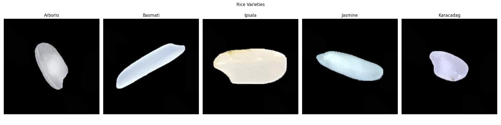
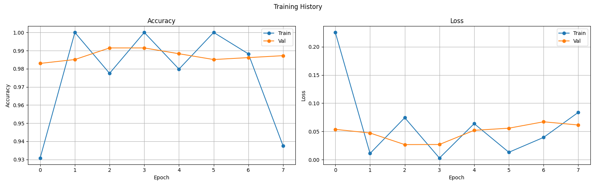
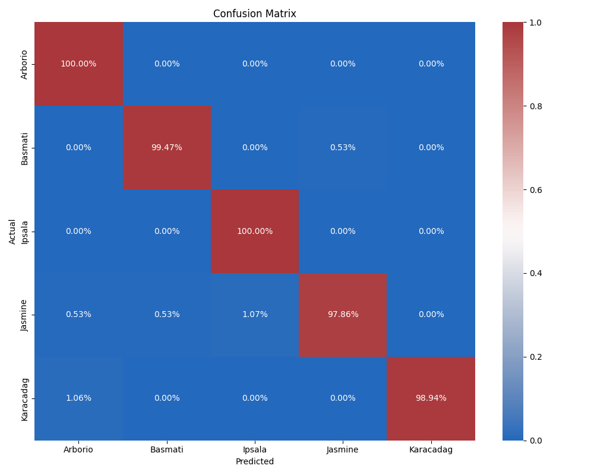

# Rice Variety Classification

A deep learning project that classifies five rice varieties using transfer learning with MobileNet.

## Rice Varieties

- Arborio
- Basmati
- Ipsala
- Jasmine
- Karacadag

## Approach

- **Model:** MobileNet (pre-trained on ImageNet) with a custom classifier head
- **Transfer Learning:** Last 20 layers of MobileNet are fine-tuned for rice-specific features
- **Data Augmentation:** Rotation, flips, shifts, and zoom applied during training
- **Optimizer:** Adam with learning rate of 0.0001

## Results

- **Test Accuracy:** 99.7%
- Arborio and Ipsala classified at 100%
- Jasmine is the most challenging variety to distinguish

### Sample Images



### Training History



### Confusion Matrix



## Setup

### 1. Install dependencies

```bash
pip install tensorflow opencv-python scikit-learn matplotlib seaborn numpy kagglehub
```

### 2. Get the dataset

The script auto-downloads the dataset from Kaggle on first run. You'll need Kaggle API credentials:

1. Go to [kaggle.com](https://kaggle.com) -> Settings -> API -> Create New Token
2. Save the downloaded `kaggle.json` to `~/.kaggle/kaggle.json`

Alternatively, download the dataset manually from [Kaggle](https://www.kaggle.com/datasets/muratkokludataset/rice-image-dataset/) and place it in the project directory as `./Rice_Image_Dataset/`.

### 3. Run

```bash
python rice_classification_v2.py
```

The best model is saved to `best_rice_model.keras`.

## Dataset Citation

Koklu, M., Cinar, I., & Taspinar, Y. S. (2021). Classification of rice varieties with deep learning methods. Computers and Electronics in Agriculture, 187, 106285. https://doi.org/10.1016/j.compag.2021.106285
