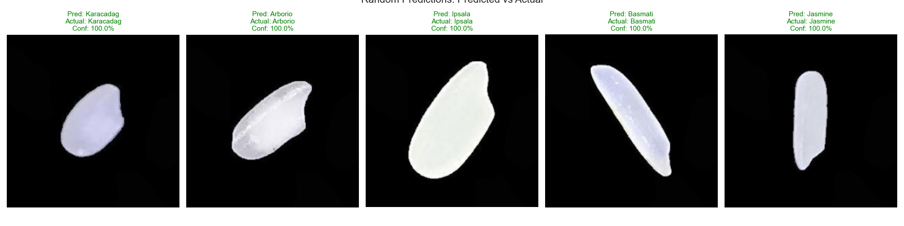
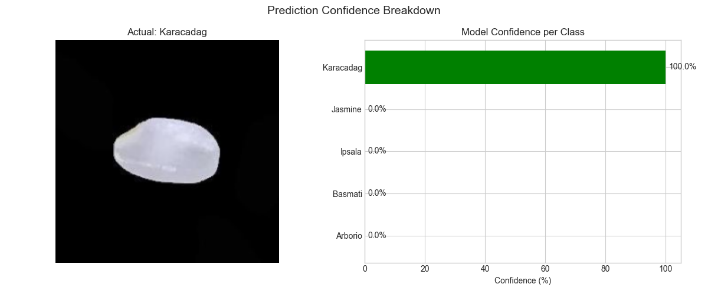
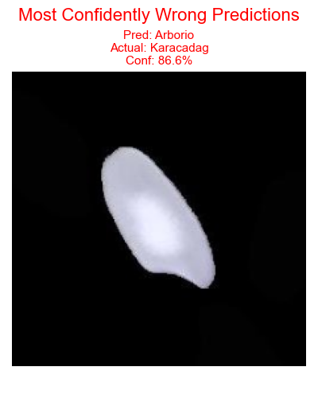
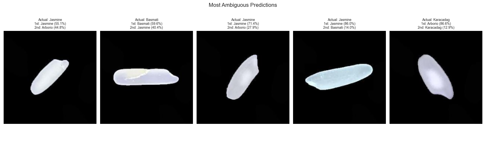
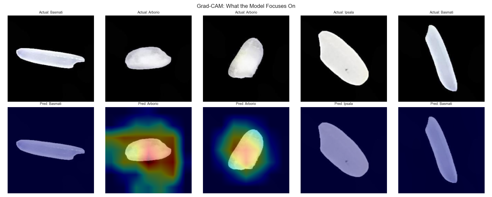
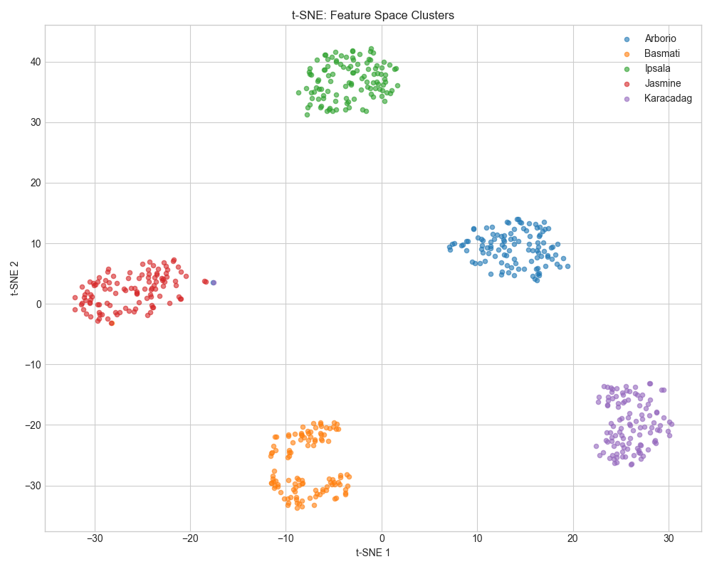
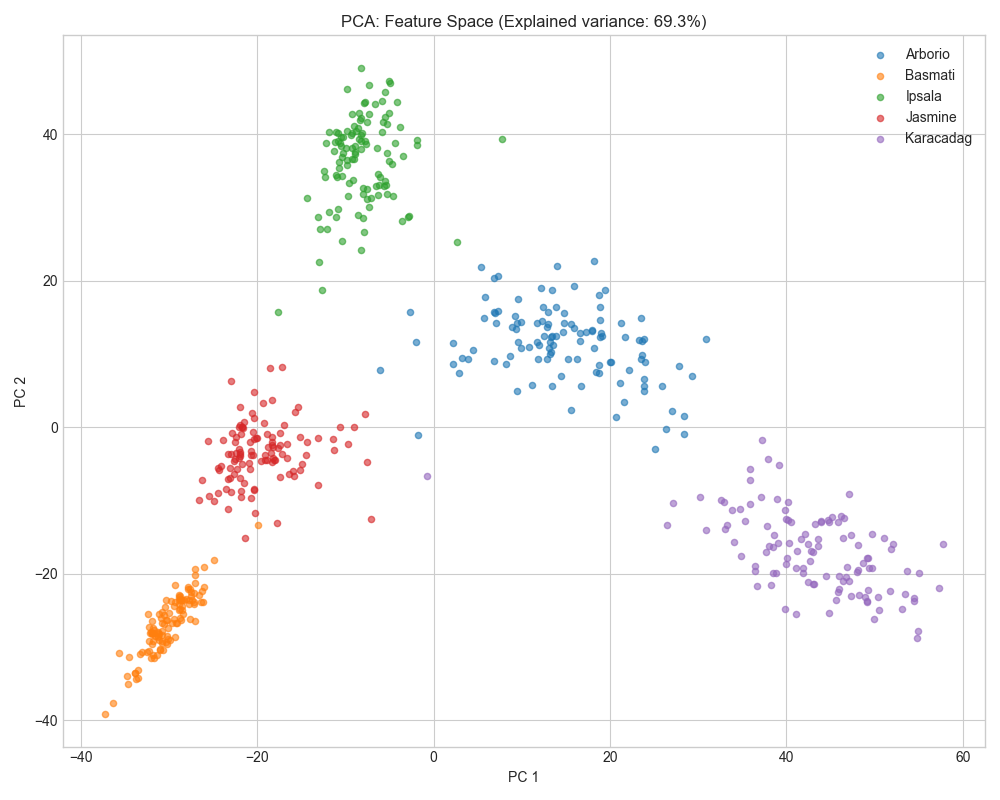
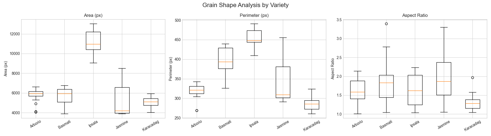
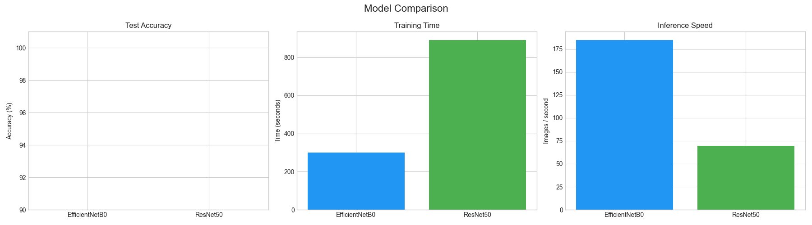

# Rice Variety Classification

A deep learning project that classifies five rice varieties using transfer learning with MobileNet.

`By Yusuf Musa`

## Rice Varieties

- Arborio
- Basmati
- Ipsala
- Jasmine
- Karacadag

## Approach

- **Model:** MobileNet (pre-trained on ImageNet) with a custom classifier head
- **Transfer Learning:** Last 20 layers of MobileNet are fine-tuned for rice-specific features
- **Data Augmentation:** Rotation, flips, shifts, and zoom applied during training
- **Optimizer:** Adam with learning rate of 0.0001
- **Data:** 1,500 images per class, stratified train/val/test split

## Results

- **Test Accuracy:** 99.82%
- Only 1 misclassification out of 562 test images
- Jasmine is the most challenging variety to distinguish
- Karacadag and Arborio are most commonly confused due to similar round grain shapes

### Sample Images


### Training History


### Confusion Matrix


## Extended Analysis

Beyond training and evaluation, the notebook includes deeper analysis:

### Random Predictions
Randomly selected test images with predicted vs actual labels and confidence scores.



### Confidence Breakdown
Per-class probability bar chart for individual predictions.



### Most Confidently Wrong Predictions
Images the model was most sure about but got wrong — reveals blind spots.



### Most Ambiguous Predictions
Images where the model was least certain — mostly Jasmine grains confused with other varieties.



### Grad-CAM Heatmaps
Visualizes which parts of the grain the model focuses on — primarily edges, shape, and surface texture.



### Feature Space Visualization
t-SNE and PCA plots showing 5 clearly separated clusters, confirming strong learned features.




### Grain Shape Analysis
Contour-based comparison of grain area, perimeter, and aspect ratio across varieties.



### Model Comparison
EfficientNet and ResNet50 benchmarked against the existing MobileNet on accuracy, speed, and model size.



### Train from Scratch
A simple CNN trained without transfer learning to demonstrate how much pretrained features help.

## Setup

### 1. Install dependencies

```bash
pip install tensorflow opencv-python scikit-learn matplotlib seaborn numpy kagglehub
```

### 2. Get the dataset

The notebook auto-downloads the dataset from Kaggle on first run. You'll need Kaggle API credentials:

1. Go to [kaggle.com](https://kaggle.com) -> Settings -> API -> Create New Token
2. Save the downloaded `kaggle.json` to `~/.kaggle/kaggle.json`

Alternatively, download the dataset manually from [Kaggle](https://www.kaggle.com/datasets/muratkokludataset/rice-image-dataset/) and place it in the project directory as `./Rice_Image_Dataset/`.

### 3. Run

Open `rice_prediction.ipynb` in Jupyter and run all cells. The best model is saved to `best_rice_model.keras`.

## Key Takeaways

- Transfer learning with MobileNet achieves near-perfect classification with relatively little data
- Jasmine is the hardest variety to distinguish, overlapping with multiple other types in feature space
- Karacadag and Arborio share similar round grain shapes, leading to occasional confusion
- Grad-CAM shows the model focuses on grain edges and shape rather than background
- t-SNE/PCA confirm the model learns distinct, well-separated feature representations

## Dataset Citation

Koklu, M., Cinar, I., & Taspinar, Y. S. (2021). Classification of rice varieties with deep learning methods. Computers and Electronics in Agriculture, 187, 106285. https://doi.org/10.1016/j.compag.2021.106285
